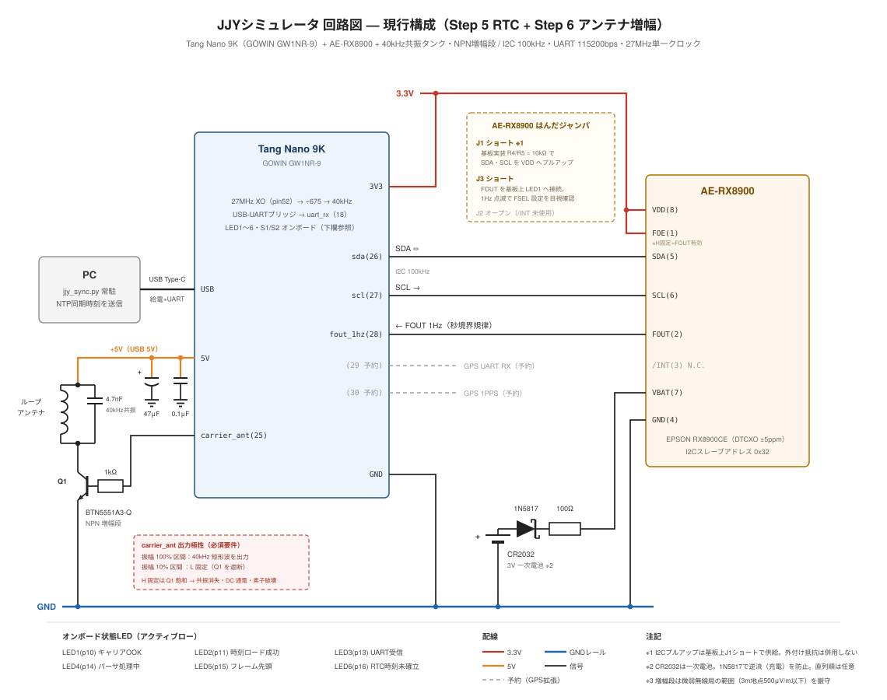

# jjy-fpga

Tang Nano 9K（GOWIN GW1NR-9）で JJY 標準電波（40kHz）を模擬し、室内に置いた電波時計を自動同期させる FPGA プロジェクトである。

> 窓のない部屋で電波時計が時刻同期できないという日常的な不便を、FPGA 入門の題材として解消することを目的としている。

詳細な設計思想・実装段階の意思決定は [docs/jjy-fpga-design-doc.md](docs/jjy-fpga-design-doc.md) に、実装中に得られた具体的な知見は [docs/knowledge.md](docs/knowledge.md) にまとめている。本 README は最低限の概要と再現手順、および電波法に関する**重要な免責事項**を記載する。



---

## 1. プロジェクト概要

### 1.1 何をするものか

- 27MHz オンボードクロックから 40kHz 矩形波を分周生成し、JJY タイムコード（OOK = On-Off Keying）に従って On/Off 変調する。
- 出力ピンに接続した小型ループアンテナから極めて微弱な電磁波として送出し、近距離（数 cm 〜 数十 cm）の電波時計に同期させる。
- 電源（USB Type-C 給電）の投入のみで動作する「家電的」な運用を最終目標とする。

### 1.2 採用方式

| 項目 | 採用 | 理由 |
|------|------|------|
| FPGA ボード | Tang Nano 9K（GOWIN GW1NR-9） | 約 3,000 円、27MHz から 40kHz への分周が割り切れる、macOS 対応、GOWIN EDA Education 版が無償・ライセンス申請不要 |
| HDL | SystemVerilog | Sipeed 公式サンプル・国内セミナー教材で採用例が多い |
| 変調方式 | OOK（On-Off Keying）による近似 | 本来 JJY は **AM 変調**（搬送波振幅を 100% / 10% で切替）だが、本実装では振幅 10% 区間を完全 OFF とする OOK で近似する。電波時計の復調は包絡線検波 + 閾値判定が一般的なため、10% を 0% に置き換えても同期に支障はない。また、FPGA から出力する波形は正弦波ではなく矩形波だが、電波時計のバーアンテナと同調回路が狭帯域 BPF として働くため、基本波 40kHz が抽出され受信可能 |
| アンテナ | 単純ループ（Step 3）→ LC 共振回路（Step 6） | 段階的に複雑度を上げる。Step 3 の単純ループは「線を GPIO に繋ぐだけ」でアナログ側の不確定要素がほぼゼロのため、近距離で同期しなければ原因はデジタル側（タイムコード or OOK 波形）に限定できる。先に共振回路を導入すると、同期失敗時に「コードが悪いのか / 共振点がずれたのか / コイルが悪いのか」が混在し原因切り分けが困難になる |

### 1.3 進捗

設計ドキュメント §9 のステップ区分に従う。

| Step | 内容 | 状態 |
|------|------|------|
| 1 | FPGA 基礎習得（Lチカ・スイッチ入力・デバウンス） | 完了 |
| 2 | 40kHz 搬送波生成、JJY タイムコードのフレーム生成、OOK 変調 | 完了 |
| 3 | 単純ループアンテナでの近距離同期確認 | 同期成功を確認済み |
| 4 | PC 定期同期（UART 受信回路 + PC 側常駐スクリプト） | 短期動作確認済（電波時計が PC 時刻に同期）、長時間運用テスト未実施 |
| 5 | DS3231 RTC モジュール接続による時刻精度向上 | 着手前 |
| 6 | LC 共振回路・トランジスタバッファによるアンテナ改良（1〜2m 到達） | 着手前 |
| 7 | 筐体化・常時運用化 | 将来目標 |

---

## 2. 前提条件

### 2.1 ハードウェア

| 品目 | 数量 | 入手先の例 | 備考 |
|------|------|-----------|------|
| Tang Nano 9K（ボード単体版） | 1 | 秋月電子通商 | 約 3,000 円。LCD 付き版でも可だが本プロジェクトでは未使用 |
| USB Type-C ケーブル（**データ通信対応**） | 1 | 任意 | 充電専用ケーブルでは書き込み不可 |
| ポリウレタン銅線（エナメル線、0.2〜0.4mm） | 10m以上 | ホームセンター等 | ループアンテナ用。Step 3 では数十回巻き |
| ボビン（ラップの芯・塩ビパイプ等） | 1 | 手元の材料で可 | 直径 3〜10cm 程度の絶縁体で中空/中実どちらも可。巻き付け作業時に座屈しない強度 |
| 動作確認用の電波時計（40kHz / JJY 受信タイプ） | 1 | 手持ち品 | 強制受信モードを備えるもの |

Step 5 では DS3231 RTC モジュール（CR2032 含む）、Step 6 では共振用コンデンサ・トリマコンデンサ・トランジスタ（2SC1815 等）・抵抗等が追加で必要になる。詳細は設計ドキュメント §9.6 および §9.7 を参照。

### 2.2 ソフトウェア

| ソフトウェア | バージョン | 用途 |
|-------------|----------|------|
| GOWIN EDA Education 版 | 1.9.11 系で動作確認 | 論理合成・P&R・ビットストリーム生成・書き込み |
| GOWIN USB Driver（Programmer 用） | OS 付属または GOWIN 配布 | macOS では FT2CH 系のシリアルデバイスが認識されることを確認 |

GOWIN EDA は Education 版を使用する限りライセンス申請は不要である。Windows / Linux でも動作する想定だが、本プロジェクトは macOS 上で構築・検証している。

### 2.3 知識・スキル

- HDL 経験は不要。ただし FPGA・クロック分周・順序回路の概念に関する基礎的な学習意欲は必要。
- 電波時計の受信原理および JJY タイムコードに関する基礎知識（NICT 公開資料が一次情報源）。
- 電波法における**微弱無線局の規定**（後述「免責事項」を必ず参照）。

---

## 3. 再現手順

以下は Step 3（近距離での電波時計同期）まで再現する手順である。コマンド類は macOS を前提とする。

### 3.1 リポジトリの取得

```bash
git clone https://github.com/ryo-yamaoka/jjy-fpga.git
cd jjy-fpga
```

### 3.2 GOWIN EDA のインストール

1. [GOWIN 公式サイト](https://www.gowinsemi.com/) から **GOWIN EDA Education 版** をダウンロードする。
2. インストーラに従ってセットアップする。Education 版はライセンス申請不要で即座に使用可能。
3. macOS の場合、初回起動時に Gatekeeper の許可が必要になることがある。

### 3.3 ベンダーマニュアルの配置（推奨）

ボード（Sipeed Tang Nano 9K）と FPGA チップ（GOWIN GW1NR-9）、および IDE（GOWIN EDA）の各種公式ドキュメントを `docs/manual/` 配下にローカル配置することを強く推奨する。トラブルシュート時の一次情報源となるため、手元にあると効率が大きく変わる。

#### 3.3.1 Tang Nano 9K ハードウェア関連

**入手先：**

- [Sipeed Tang Nano 9K Wiki](https://wiki.sipeed.com/hardware/en/tang/Tang-Nano-9K/Nano-9K.html)（オンライン情報源）
- 各種 PDF は同 Wiki ページからリンクされている GitHub / Dropbox から取得可能

**揃えておくと有用なドキュメント：**

| 種別 | 内容 | 主な参照場面 |
|------|------|------|
| Tang Nano 9K Schematic | ボード回路図 | ピン配置の確認、外部回路接続、電源系統 |
| Tang Nano 9K Datasheet | ボード仕様概要 | オンボード機能・コネクタ仕様 |
| GW1NR Series Data Sheet（DS117） | GW1NR-9 チップ電気特性 | IO 電気特性、IO_TYPE 選択、駆動電流の根拠 |
| GW1N(R) Series Pinout Manual（UG104） | パッケージ別ピンアウト表 | ピン番号と Bank の対応、特殊機能ピン |
| GW1N(R) Series of FPGA Products User Guide（UG100） | アーキテクチャ全般 | LUT / FF / BSRAM / PLL の構造理解 |

#### 3.3.2 GOWIN EDA ソフトウェア関連

**入手先：**

- GOWIN EDA インストール先の `IDE/doc/` または `Doc/` ディレクトリに同梱されている。
- または [GOWIN Documents ページ](https://www.gowinsemi.com/en/support/database/) からダウンロードできる。

**揃えておくと有用なドキュメント：**

| ドキュメント番号 | 内容 | 主な参照場面 |
|------|------|------|
| SUG100 | Gowin Software User Guide | GOWIN EDA 全般の操作 |
| SUG113 | Gowin FPGA Design Guide | 設計フロー全体 |
| SUG918 | Gowin Software Quick Start Guide | 初回セットアップ |
| SUG550 | GowinSynthesis User Guide | 合成オプション・SystemVerilog 対応 |
| SUG935 | Gowin Design Physical Constraints User Guide | `.cst` 記法 |
| SUG940 | Gowin Design Timing Constraints User Guide | `.sdc` 記法 |
| SUG937 | Gowin Software User Messages Reference | エラー・警告コードの引き当て |
| SUG114 | Gowin Analyzer Oscilloscope User Guide | GAO によるオンチップ波形観測 |
| UG286 | Gowin Clock User Guide | rPLL / 分周器・クロックリソース |
| UG289 | Gowin Programmable IO (GPIO) User Guide | IO_TYPE / DRIVE / PULL_MODE 詳細 |

#### 3.3.3 配置方針

これらのドキュメントは Sipeed および GOWIN の著作物であり再配布が制限されるため、**本リポジトリには含めない**（`.gitignore` で `docs/manual/` 配下を除外している）。各自がローカルに配置する運用とする。

### 3.4 プロジェクトを開く

GOWIN EDA を起動し、以下のプロジェクトファイルを開く。

```
gowin_project/jjy_sim/jjy_sim.gprj
```

このプロジェクトは `hdl/src/*.sv` および `hdl/constraints/*.cst|*.sdc` を **相対パス参照** している。GOWIN EDA で個別にファイルを追加し直す必要はない。

> **注意：** 何らかの理由でファイルを追加し直す場合、`Add Files` ダイアログの「Copy file to project」のチェックを必ず**外す**こと。チェックが入っていると `gowin_project/<name>/src/` 配下にコピーが生成され、リポジトリの正本と二重管理になる。詳細は [docs/knowledge.md §2.2](docs/knowledge.md) を参照。

### 3.5 トップモジュールの確認

トップモジュールは `jjy_top` である（`hdl/src/jjy_top.sv`）。`Project → Configuration → Synthesize → Top Module/Entity` が `jjy_top` になっていること、および Verilog 言語設定が `System Verilog 2017` になっていることを確認する。

### 3.6 合成・P&R・ビットストリーム生成

GOWIN EDA の左ペインから順に実行する。

1. `Synthesize`
2. `Place & Route`
3. 生成された `gowin_project/jjy_sim/impl/pnr/jjy_sim.fs` がビットストリームファイルである。

P&R 完了後、`gowin_project/jjy_sim/impl/pnr/jjy_sim.rpt.txt` の **Pinout by Port Name** セクションで、各ポートの `Constraint=Y` および配置ピンが意図通りであることを確認する。

### 3.7 ピン配置（重要）

`hdl/constraints/jjy_top.cst` にて以下のピン配置を行っている。

| ポート | ピン | Bank | IO_TYPE | 用途 |
|-------|------|------|---------|------|
| `clk` | 52 | 2（3.3V） | LVCMOS33 | 27MHz オンボードクロック |
| `uart_rx` | **18** | 2（3.3V） | LVCMOS33 | **オンボード USB-UART (FT2232HQ Channel B / BL702) からの受信。Step 4 の PC 定期同期で使用** |
| `carrier_led` | 10 | 3（1.8V） | LVCMOS18 | OOK 波形を LED1 に出力（目視確認用） |
| `carrier_ant` | **25** | 1/2（3.3V） | LVCMOS33（DRIVE=24mA） | **ループアンテナ駆動用** |
| `led_marker` | 11 | 3（1.8V） | LVCMOS18 | LED2: `time_valid` を 0.5 秒ストレッチ（時刻ロード成功表示） |
| `led_one` | 13 | 3（1.8V） | LVCMOS18 | LED3: `uart_byte_valid` を 62 ms ストレッチ（UART バイト受信表示） |
| `led_zero` | 14 | 3（1.8V） | LVCMOS18 | LED4: `time_setter.proc_busy` を 0.5 秒ストレッチ（パーサ進行中表示） |
| `led_frame_sync` | 15 | 3（1.8V） | LVCMOS18 | LED5: フレーム先頭（毎分秒 0）で 1 秒点灯 |

ループアンテナはピン **25** と **GND** の間に接続する。詳細な配線については [docs/knowledge.md §9.6](docs/knowledge.md) を参照。`uart_rx` (ピン 18) は Tang Nano 9K のオンボード USB Type-C コネクタ経由の USB-UART ブリッジに直結されており、追加配線は不要。

### 3.8 書き込み

1. Tang Nano 9K を USB Type-C で PC に接続する。
2. GOWIN Programmer を起動し、`Edit → Cable Settings` で `Cable: Gowin USB Cable(FT2CH)` が認識されていることを確認する。
3. **動作確認段階**：`SRAM Program` モードで `jjy_sim.fs` を書き込む（電源を切ると揮発する）。
4. **常用化段階**：`Embedded Flash Mode` で書き込むと電源再投入後も動作する。

### 3.9 動作確認（Step 3 相当）

1. ピン 25 と GND の間にループアンテナ（ポリウレタン銅線を 30〜100 回巻いたもの）を接続する。
2. 電波時計の受信ボタンを長押しして**強制受信モード**に切り替える。
3. ループアンテナを電波時計に密着させる。**ループ面と電波時計のバーアンテナの軸が直交する向き**で結合が最大になる。
4. 5〜10 分程度待つ。電波時計の受信中アイコンが消失し、表示時刻が「FPGA 起動時刻 + 経過時間」付近に更新されれば同期成功。
5. 起動時の初期時刻は `hdl/src/jjy_top.sv` の `hour_tens` / `hour_ones` 等のリセット値で決まる（現状は **12:00** 固定、日付は 2026-04-13 月曜日固定）。同期した電波時計の表示が起動からの経過分を含めてこの値の付近になっていれば正常である。

同期しない場合のチェック手順は [docs/knowledge.md §9.8](docs/knowledge.md) を参照。

### 3.10 PC 定期同期（Step 4 相当）

Step 4 では、PC から FPGA に対して USB-UART 経由で時刻を定期送信し、FPGA 内部時刻を NTP 同期した PC の時刻に合わせ続ける。追加ハードウェアは不要で、書き込みに使っている USB Type-C ケーブルがそのままシリアル回線を兼ねる。

#### 3.10.1 プロトコル

21 バイト固定長 ASCII。

```
T2026-04-13T12:00:00\n
```

| 項目 | 値 |
|------|------|
| ボーレート | 115200 bps |
| データビット | 8 |
| パリティ | なし |
| ストップビット | 1 |
| フロー制御 | なし |
| 受信時刻の意味 | 末尾 `\n` を受け終えた瞬間を「指定秒の頭」とみなす |
| 妥当性検証失敗時 | 受信内容を破棄し、内部時刻は維持される |

詳細仕様は [docs/jjy-fpga-design-doc.md §9.5](docs/jjy-fpga-design-doc.md) 参照。

#### 3.10.2 PC 側スクリプトの依存解決

```bash
python3 -m pip install -r tools/requirements.txt
```

仮想環境を使う場合は `python3 -m venv .venv && source .venv/bin/activate` を先に実行する。

#### 3.10.3 シリアルポートの確認（重要）

ビットストリームを書き込み済みの状態でも、**送信先のシリアルポートが正しくないと FPGA UART には 1 バイトも届かない**。Tang Nano 9K のリビジョンにより以下の罠がある：

- **旧版（FTDI FT2232HQ）**：2 つの `cu.usbserial-*` が現れる。**末尾番号が大きい方が UART (Channel B)**、小さい方は JTAG (Channel A)。Channel A に書き込んでも JTAG エンジンに吸われて FPGA UART には届かない
- **新版（BL702/BL616）**：`cu.debug-console` という管理用チャネルが追加で見える。これは FPGA UART には繋がっていない

`tools/jjy_sync.py` の自動検出はこれらを既に処理しているが、まず `--list` で確認しておく：

```bash
python3 tools/jjy_sync.py --list
```

出力例（旧版 FT2232HQ）：

```
device      : /dev/cu.usbserial-11400  (skipped: FTDI Channel A = JTAG)
device      : /dev/cu.usbserial-11401  (preferred: FTDI Channel B = UART)
```

#### 3.10.4 単発送信による動作確認

```bash
python3 tools/jjy_sync.py --once -v
```

「次の `分:30` 秒」のタイミングで `T<送信時刻>\n` を送出する。**FPGA 側 LED で物理到達を必ず確認する**：

| LED | ピン | 確認内容 |
|-----|------|---------|
| LED3 | 13 | UART 1 バイト受信のたびに点灯。21 バイト burst が見えるはず |
| LED4 | 14 | `'T'` 受信後の処理中は点灯（約 0.5 秒） |
| LED2 | 11 | フォーマット検証成功後の `time_valid` で点灯（約 0.5 秒） |

**LED3 が点滅しなければシリアルポート選択を疑う**（前項参照）。LED3 は点滅するが LED2 が点かない場合はプロトコルや FPGA 側ロジックを疑う。詳細な切り分け手順は [docs/knowledge.md §10.5](docs/knowledge.md) 参照。

LED2 が点灯したら、電波時計を強制受信モードにし、5〜10 分後に PC の時計と一致するかを確認する。

#### 3.10.5 常駐スクリプトとして起動

5 分ごとに送信する場合（既定値）。

```bash
python3 tools/jjy_sync.py
```

送信間隔は `--interval` で秒単位指定（例：`--interval 60` で毎分）。1 ポイント当たり 21 バイトのみで負荷は無視できる。送信は常に「`分:30` 秒」のアンカーに合わせるため、`--interval` を 60 未満にしても実効的には毎分 1 回の送信となる。

#### 3.10.6 macOS で常駐化（launchd）

テンプレート [tools/com.example.jjy-sync.plist](tools/com.example.jjy-sync.plist) を以下の手順で展開する。

1. `tools/com.example.jjy-sync.plist` の `/ABSOLUTE/PATH/TO/jjy-fpga/` を実パスに置換し、必要なら `--interval` の値も調整する
2. `~/Library/LaunchAgents/com.example.jjy-sync.plist` にコピー
3. `launchctl load -w ~/Library/LaunchAgents/com.example.jjy-sync.plist`
4. `tail -f /tmp/jjy_sync.log` でログを監視

停止は `launchctl unload ~/Library/LaunchAgents/com.example.jjy-sync.plist`。

#### 3.10.7 シミュレーションによるロジック検証（任意）

実機投入前に UART 受信〜時刻反映ロジックを Icarus Verilog 等のシミュレータで確認できる。

```bash
brew install icarus-verilog
iverilog -g2012 -o /tmp/tb_time_setter.vvp \
    hdl/tb/tb_time_setter.sv \
    hdl/src/uart_rx.sv \
    hdl/src/time_setter.sv \
    hdl/src/date_calc.sv
vvp /tmp/tb_time_setter.vvp
```

`OK` の表示が出ればすべての検証ケースに通過している。

---

## 4. ディレクトリ構成

```
jjy-fpga/
├── README.md                       # 本ファイル
├── LICENSE                         # MIT License
├── docs/
│   ├── jjy-fpga-design-doc.md      # 設計ドキュメント（思想・意思決定）
│   ├── knowledge.md                # 実装知見集（実装中の発見と教訓）
│   └── manual/                     # GOWIN 公式マニュアル類の配置先（gitignore 対象、各自配置）
├── hdl/
│   ├── src/                        # SystemVerilog ソース（正本）
│   ├── constraints/                # ピン制約 (.cst) とタイミング制約 (.sdc)
│   └── tb/                         # テストベンチ
├── tools/
│   ├── jjy_sync.py                 # PC 定期同期デーモン（Step 4）
│   ├── requirements.txt            # pyserial 依存
│   └── com.example.jjy-sync.plist  # macOS launchd テンプレート
└── gowin_project/
    └── jjy_sim/
        ├── jjy_sim.gprj            # GOWIN EDA プロジェクト（相対パス参照）
        └── impl/                   # 生成物（gitignore 対象）
```

---

## 5. 関連ドキュメント

- [設計ドキュメント](docs/jjy-fpga-design-doc.md) — プロジェクトの動機、ボード/HDL 選定理由、Step 1〜7 の詳細計画、電波法に関する詳細な検討。
- [実装知見集](docs/knowledge.md) — Tang Nano 9K のハードウェア仕様、GOWIN EDA の落とし穴、JJY タイムコード実装の教訓。
- [回路図](docs/schematic.svg) — 現行実機構成（RX8900 RTC + 共振タンク・NPN 増幅段）の結線図。

---

## 6. 免責事項

**本プロジェクトを実機で動作させる前に、必ず本節を熟読すること。**

### 6.1 日本国内における電波法上の位置付け

JJY と同一の 40kHz 帯は、日本では NICT（情報通信研究機構）が独占的に運用する標準電波帯である。本プロジェクトの出力は、原理上 JJY と同じ周波数の電波を空間に放射するものである。

日本の電波法では、無線設備から **3 m の距離における電界強度が一定値以下** であれば、免許不要の **微弱無線局** として扱われる（電波法施行規則 第 6 条第 1 項第 1 号）。322MHz 以下の周波数帯（40kHz はここに含まれる）では、その基準値は **500μV/m** である。

本プロジェクトの設計（Tang Nano 9K の GPIO 直結 + 小型ループアンテナ、最大駆動電流 24mA）は、この微弱無線局の範囲に**十分なマージンを持って**収まることを意図している。同等規模のキット製品が微弱無線局として市販されている事実も、この範囲内であることの傍証となる。

### 6.2 利用者が遵守すべき事項

本リポジトリの内容を再現・改変・運用するにあたり、利用者は以下を**自身の責任において**遵守すること。

1. **増幅回路を追加してはならない。**
   トランジスタバッファ、オペアンプ、RF パワーアンプ等を用いて出力を増強した場合、容易に微弱無線局の上限を超える可能性がある。設計ドキュメント §9.5 で言及するトランジスタバッファについても、追加する場合は到達距離の最低限の確保を目的とし、過剰な駆動を避けること。
2. **大型・高 Q のアンテナを意図的に構成してはならない。**
   コイルの巻数を極端に増やしたり、外部アンテナ・地線を引き回したりすると、電界強度が想定を超えて伸長する場合がある。本プロジェクトの想定到達距離は概ね 1〜2 m 以内である。
3. **基準周波数（40kHz）以外への流用に注意。**
   ロジックを改変して別周波数を出力する場合、対象周波数帯ごとに微弱無線局の電界強度基準が異なる。事前に [総務省 電波利用ホームページ](https://www.tele.soumu.go.jp/) 等で該当規定を必ず確認すること。
4. **周囲の電波時計への意図しない影響に責任を持つこと。**
   送出時刻が誤っていると、近隣の電波時計（家族の所有物、職場、賃貸住宅の隣室など）の表示まで誤同期させる可能性がある。動作確認は時刻が正しいことを確認した上で行い、長期運用時は意図しない影響範囲が生じていないか定期的に点検すること。
5. **国外で運用しないこと。**
   本プロジェクトの法的根拠は日本の電波法に基づく微弱無線局規定である。海外では別の規制（FCC Part 15、CE 等）が適用され、判断基準が異なる。本リポジトリは日本国内での個人利用のみを想定している。

### 6.3 微弱無線局判定の限界

電波法上の微弱無線局判定は、本来は総務省告示に規定された試験設備（電波暗室・3 m 法測定等）で実施されるべきものであり、個人が自宅で正確に電界強度を測定することは困難である。本プロジェクトの「微弱無線局の範囲内」という主張は、回路規模・駆動電流・先行類似製品との比較に基づく**設計上の想定**であって、定量的に実測された保証ではない。利用者はこの不確実性を理解した上で、十分なマージンを持つ運用（増幅しない、アンテナを巨大化しない、到達距離を最小限に留める）を行うこと。

### 6.4 無保証

本リポジトリの利用に起因または関連して生じたいかなる損害（電波時計の誤同期、周辺機器への影響、電波法違反による行政処分、機器の損傷等を含むがこれらに限定されない）についても、著作者および貢献者は一切の責任を負わない。

利用者は、本プロジェクトの内容を**自己の責任**で再現・運用するものとする。

---

## 7. ライセンス

[MIT License](LICENSE)

Copyright (c) 2026 ryo-yamaoka

<!-- PR作成テスト用の一時的な追記 -->
