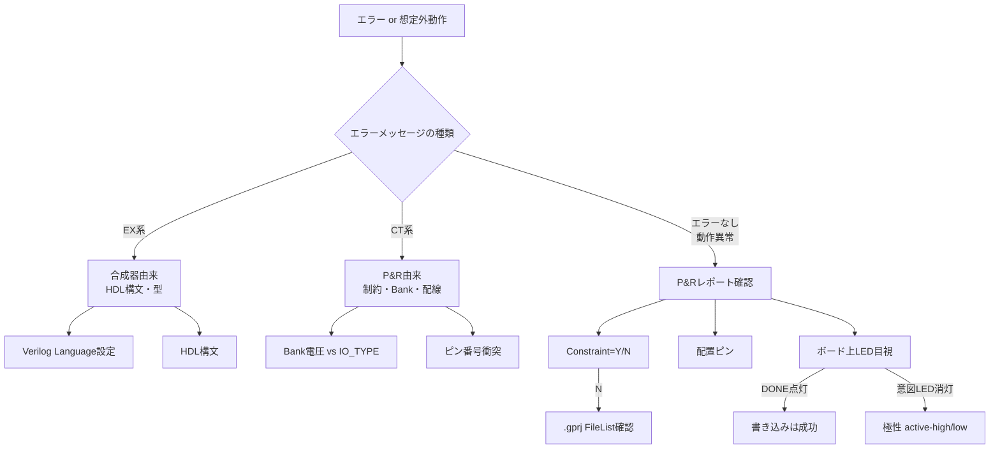

# JJY-FPGA 実装知見集

> 実装中に遭遇した問題と解決方法、Tang Nano 9K / GOWIN EDA / Verilog合成に関する実用知識を蓄積する文書。
> 設計ドキュメント [jjy-fpga-design-doc.md](jjy-fpga-design-doc.md) が「これから何を作るか」を扱うのに対し、本文書は「実際に作ってみて分かったこと」を扱う。

---

## 1. Tang Nano 9K ハードウェア知見

### 1.1 IO Bank 構成

GW1NR-9（Tang Nano 9K搭載品）は3つのIO Bankを持ち、各BankのVCCIO（IO電源電圧）はボード上で固定されている。

| Bank | VCCIO | 備考 |
|------|-------|------|
| 1 | 3.3V | 汎用GPIO |
| 2 | 3.3V | 汎用GPIO、HDMI兼用 |
| 3 | **1.8V固定** | オンボードLED・ボタン・内蔵Flash共用 |

**重要：制約ファイル（`.cst`）の `IO_TYPE` はBank電圧と整合させる必要がある。** Bank 3に配置する信号は `LVCMOS18` を指定すること。`LVCMOS33` を指定するとP&Rで `CT1136 Bank 3 vccio(1.8) is locked by other constraint` エラーになる。

### 1.2 オンボードLEDの仕様

- 個数：6個（LED1〜LED6）
- 接続ピン：10, 11, 13, 14, 15, 16（**すべてBank 3**）
- 極性：**アクティブロー**（FPGAから0を出力すると点灯）
- 駆動：1.8V前提で電流制限抵抗が選定されており、輝度に懸念はない

### 1.3 ボード上のLED種別と混同注意

| LED | 用途 | 制御元 |
|-----|------|-------|
| LED1〜LED6 | ユーザー用 | FPGAのGPIO（ピン10/11/13/14/15/16） |
| DONE | FPGAコンフィグ完了表示 | FPGAコンフィグレーション回路（自動） |
| PWR | 電源 | 給電時常時点灯 |

LED1〜6 と DONE LEDは基板上で**隣接して配置されている**ため視認時に混同しやすい。書き込み直後にDONE LEDが点灯するが、これはユーザーロジックとは独立した系統である。「LED1付近の別のLEDが光っている」と感じた場合、まずDONE LEDを疑う。

### 1.4 デバイス型番

- **PN（Part Number）**: GW1NR-LV9QN88PC6/I5
- **GOWIN EDA内部表記**: gw1nr9c-004
- 末尾の `C6` は商用温度グレード、`I5` は産業温度グレード

### 1.5 オンボードクロック

| 項目 | 値 |
|------|-----|
| 発振周波数 | 27MHz |
| 接続ピン | **52** |
| Bank | 2（3.3V） |
| IO_TYPE | LVCMOS33 |
| GW1NR-9内部のクロックリソース | グローバルクロック（PCLK）として配線可能 |

`.cst` での記述例：

```
IO_LOC "clk" 52;
IO_PORT "clk" PULL_MODE=UP IO_TYPE=LVCMOS33;
```

27MHzは40kHz生成（÷675）、UART 9600bpsや115200bps生成、I2Cマスタクロック生成など、本プロジェクト全体で唯一のクロックソースとなる。GW1NR-9内蔵PLL（rPLL）で他周波数へ昇降することも可能だが、本プロジェクトの初期段階ではPLLを使わず単純なカウンタ分周で対応する。

### 1.6 オンボードボタンの仕様

Tang Nano 9Kにはオンボードボタンが2個搭載されている。設計ドキュメント §9.2 では「ピン3/4」とのみ記載されているが、実機シルク表記とピンの対応は以下の通り。

| 物理ボタン（シルク表記） | 接続ピン | Bank | 極性 |
|----------------------|---------|------|------|
| **S1** | **4** | 3（1.8V） | アクティブロー（押下時 0、解放時 1） |
| **S2** | **3** | 3（1.8V） | 同上 |

注意点：

- **S1とS2のピン番号は直感に反するため要注意**: ボード上の並びは「S1 S2」だが、ピン番号は「4 3」と逆順
- **押下時にGND（0）** : LEDと同じくアクティブロー。HDL側で「押下=信号LOW」として読む
- **アンプッシュ（解放）時の状態** : 内部プルアップ（`PULL_MODE=UP`）を有効にしておく。外付けプル抵抗は不要
- **チャタリング対策必須** : 機械式タクトスイッチのため、押下/解放の瞬間に数ms〜数十msのバウンス（高速ON/OFF振動）が発生する。HDLで直接読むと1回押下が複数回として誤検出される。**デバウンス回路（安定状態を10〜20ms保持してから確定）が必須**
- **メタステーブル対策必須** : 外部の非同期信号をFPGA内部の同期回路に取り込む際、FFが0と1の中間値で固まる「メタステーブル」状態が発生し得る。**2段FFシンクロナイザ**（FFを2個直列に入れる）で確率を実用上ゼロまで下げる
- **典型的な`.cst` 記述**:

```
IO_LOC "btn[0]" 4;
IO_LOC "btn[1]" 3;
IO_PORT "btn[0]" PULL_MODE=UP IO_TYPE=LVCMOS18;
IO_PORT "btn[1]" PULL_MODE=UP IO_TYPE=LVCMOS18;
```

汎用デバウンサ実装例は [hdl/src/debouncer.sv](../hdl/src/debouncer.sv) を参照。

### 1.7 オンボード USB-UART (BL616 / BL702 / FT2CH) のピン

Tang Nano 9K の USB Type-C コネクタには、書き込み用の JTAG チャネルとは別に **USB-UART ブリッジが統合**されており、PC 側からは仮想シリアルポートとして見える。FPGA 側のピンは以下に固定されている。

| 信号 | FPGA ピン | Bank | IO_TYPE | 方向 |
|------|---------|------|---------|------|
| **uart_tx** | **17** | 2（3.3V） | LVCMOS33 | FPGA → PC |
| **uart_rx** | **18** | 2（3.3V） | LVCMOS33 | PC → FPGA |

注意点：

- ボードリビジョンによりブリッジチップが異なる（旧版：FTDI FT2232HQ、新版：Sipeed BL702 / BL616）。**FPGA からのピン番号は同じ**だが、PC 側で見えるシリアルデバイスの名称・VID/PID は変わるため、自動検出スクリプトは複数候補を許容する設計が望ましい
- macOS では `cu.usbserial-*` と `tty.usbserial-*` の両方が現れる。アプリケーションからは **`cu.*` を使う**（call-out 用、DTR の待機を行わない）
- `IO_PORT "uart_rx" PULL_MODE=UP` を指定する。PC 切断時に入力がフローティングになると、誤ったスタートビットを拾う可能性がある
- 外部から非同期で入ってくる信号なので、内部論理に取り込む前に **2 段 FF シンクロナイザを通す**（[hdl/src/uart_rx.sv](../hdl/src/uart_rx.sv) 参照）

#### 1.7.1 FT2232HQ Dual-Channel の罠（旧版ボード）

警告。旧版 Tang Nano 9K（FTDI FT2232HQ、VID 0x0403:0x6010）は **2 チャネル USB-UART/JTAG ブリッジ**であり、PC 側から **隣接した 2 つの `cu.usbserial-*` デバイス**として見える。

| チャネル | 末尾番号 | 用途 |
|---------|---------|------|
| **Channel A** | **小さい方**（例：`cu.usbserial-11400`） | **JTAG**（書き込み用、FPGA UART には接続されない） |
| **Channel B** | **大きい方**（例：`cu.usbserial-11401`） | **UART**（FPGA pin 17/18 に直結） |

両者ともに `description` / `manufacturer` / `product` フィールドが同じ "JTAG Debugger" / "SIPEED" になっており、メタデータからは区別できない。**末尾の数字が大きい方を選ぶ**のが正しい識別方法。Channel A に書き込んでも JTAG エンジンに吸われて FPGA UART には何も届かないが、書き込み自体は成功するため **PC 側ログ（`pyserial` の `write()` 戻り値や「sent」表示）からは送信成功と区別がつかない**。

実装例は [tools/jjy_sync.py](../tools/jjy_sync.py) の `detect_port` 関数を参照。FTDI 0x0403:0x6010 のペアを検出したら末尾番号が大きい方を採る、という分岐を持っている。

#### 1.7.2 BL702 / BL616 ファームの `cu.debug-console` 罠（新版ボード）

警告。新版（BL702/BL616）の最新ファームウェアでは、UART チャネル本体とは別に **`/dev/cu.debug-console` という管理チャネル**が CDC-ACM として現れる場合がある。これは JTAG / リセット制御用で **FPGA UART には接続されていない**。

`description` / `manufacturer` フィールドが空（None）であることが多く、デバイス名が `debug-console` を含むため文字列マッチで除外できる。`detect_port` の rejects リストに `debug-console` を入れている。

#### 1.7.3 PC 側ログだけでは届いた保証にならない

報告。`pyserial` で `ser.write(payload); ser.flush()` が成功し、ログに `sent T...` と出ても、それは **OS のシリアルバッファに書き込まれたこと**を意味するに過ぎない。送信先のチャネルが管理面（JTAG, debug-console）であった場合、データはそこで吸収され FPGA まで届かない。

実機で確認する場合は **FPGA 側の状態 LED** を必ず併用する。本プロジェクトでは [hdl/src/jjy_top.sv](../hdl/src/jjy_top.sv) で以下のステータス LED を出している：

| LED | ピン | 表示内容 |
|-----|------|---------|
| LED2 | 11 | `time_valid`（時刻ロード成功）を 0.5 秒ストレッチ |
| LED3 | 13 | `uart_byte_valid`（1 バイト受信ごと）を 62 ms ストレッチ |
| LED4 | 14 | `time_setter.proc_busy`（パーサが 'T' 受信後の処理中）を 0.5 秒ストレッチ |
| LED5 | 15 | `sec_in_frame == 0`（フレーム先頭）で 1 秒点灯 |

PC 送信時に LED3 が点滅 → UART 物理層 OK、LED4 が点灯 → 'T' を認識し state machine が動いている、LED2 が点灯 → 全フォーマット検証 OK で内部時刻に反映、という順で切り分けられる。Step 4 のブリングアップでこの 3 段切り分けが原因特定の決め手になった。

---

## 2. GOWIN EDA 操作知見

### 2.1 Verilog合成モードのデフォルト

GOWIN Synthesis のデフォルト言語設定は **Verilog 2001**。SystemVerilog固有の `logic` 型・`always_ff`・`typedef` などを使うと、以下のような合成エラーになる。

```
ERROR (EX3444) : 'logic' is an unknown type
ERROR (EX3872) : 'logic' is not declared
```

**対処法：**

- `Project → Configuration → Synthesize → General → Verilog Language` を `System Verilog 2017` に変更する
- または `wire` / `reg` のみで記述する（純粋な組合せ回路や単純なFFなら十分）

設計ドキュメント §4.2 ではSystemVerilog採用方針となっているため、本プロジェクトでは前者を選択するのが本筋。ただし `assign` だけの単純な回路では `wire` で実装しても機能上は等価。

### 2.2 ファイル追加時の「Copy file to project」問題

`Add Files` ダイアログで「**Copy file to project**」がデフォルトでONになっている場合がある。このまま追加すると、

1. リポジトリ内の正本（例：`hdl/src/led_on.sv`）とは別に `gowin_project/<name>/src/` 配下にコピーが作られる
2. `.gprj` のFileListはコピー側を参照する
3. 合成パイプラインはコピー側のみを読む
4. **正本への編集が合成に反映されない**

二重管理状態になり、知らずにいると「ソースを変えたのにエラーが消えない」という現象に陥る。

**対処法：**

- ダイアログ右下の「Copy file to project」のチェックを必ず外して追加する
- 既にコピーされている場合は、Removeしてから再追加するか、`.gprj` を直接編集して相対パスに書き換える

本プロジェクトでは `gowin_project/jjy_sim/jjy_sim.gprj` が `../../hdl/src/led_on.sv` のような相対参照を持つ構成にしている。

### 2.3 .gprj 直接編集の注意

GOWIN EDAが起動中に `.gprj` を外部エディタから編集すると、GOWIN側の自動保存で上書きされる場合がある。**直接編集する前にGOWIN EDAを必ず終了させること。**

### 2.4 ファイル追加でフィルタを切り替える

`Add Files` ダイアログのデフォルトファイル種別フィルタは `Verilog Files (*.v, *.sv)` になっていることがあり、`.cst` が一覧に出てこない。フィルタを `Constraints File (*.cst, *.sdc)` に切り替えること。`.sv` だけ追加して `.cst` の追加を忘れると、P&R時に制約が無視される。

---

## 3. ピン制約ファイル（.cst）

### 3.1 基本書式

```
IO_LOC "<port_name>" <pin_number>;
IO_PORT "<port_name>" PULL_MODE=<UP|DOWN|NONE> DRIVE=<mA> IO_TYPE=<standard>;
```

### 3.2 IO_TYPE の選択

配置先BankのVCCIOに整合する規格を指定する。

| Bank VCCIO | 主なIO_TYPE |
|-----------|------------|
| 1.8V | LVCMOS18 |
| 2.5V | LVCMOS25 |
| 3.3V | LVCMOS33 |

不一致の場合は `CT1136` エラー。

### 3.3 PULL_MODE と DRIVE

- `PULL_MODE=UP` : 内部プルアップ。出力ポートでもフローティング防止に有効
- `PULL_MODE=NONE` : プル抵抗なし
- `DRIVE=4|8|16|24` : 駆動電流（mA）。Tang Nano 9Kでは入門時8mAが中庸。アンテナ駆動など大電流が必要な場面で増やす

### 3.4 制約ファイル未登録時の挙動

`.cst` がプロジェクトに登録されていない／空の場合、P&Rは**制約なしで自動配置**を行う。レポート上は `Constraint=N` と表示される。意図と異なるピンに配置され、当然LEDも光らない。

---

## 4. タイミング制約ファイル（.sdc）

`.cst` がピン位置や電気的特性を指定する**物理制約**を担うのに対し、`.sdc`（Synopsys Design Constraints）はクロック周波数・信号遅延・パスの扱いといった**タイミング制約**を担う。GOWIN EDAは業界標準のSDCサブセットをサポートしている。

### 4.1 なぜ必要か

`.sdc` がないと、合成器・配置配線ツールは以下の情報を持てない。

- クロックの周期（27MHz？100MHz？）
- 各FF間の論理パスが1クロック内に終わるかの保証
- 外部から来る信号の到達タイミング
- 出力信号が外部回路に到達するまでの猶予

結果、**動作周波数が低い設計では実機は動くが**、P&Rで以下のような警告が出る。

```
WARN (TA1132) : 'clk' was determined to be a clock but was not created.
```

警告は「クロックとしての使い方は推測したが、明示宣言が無い」を意味し、**機能上は無害**だが、タイミング解析の精度低下や、複数クロックドメイン化したときの問題顕在化につながる。

### 4.2 最小限の `.sdc`

クロック1つだけのプロジェクトでは、以下1行で TA1132警告を解消できる。

```
create_clock -name clk -period 37.037 -waveform {0 18.518} [get_ports {clk}]
```

| 引数 | 意味 |
|------|------|
| `-name clk` | クロック名（任意。後の制約から参照する識別子） |
| `-period 37.037` | 周期（**ns単位**）。1 / 27_000_000 ≈ 37.037 |
| `-waveform {0 18.518}` | 立ち上がり・立ち下がりの時刻（duty 50%） |
| `[get_ports {clk}]` | 対象信号 |

本プロジェクトでは [hdl/constraints/clock.sdc](../hdl/constraints/clock.sdc) として共通配置している。

### 4.3 主要なSDCコマンド

| コマンド | 用途 | 使う場面 |
|---------|------|---------|
| `create_clock` | クロックの周期・波形を宣言 | ほぼ必須 |
| `set_input_delay` | 外部信号がFPGAに届くまでの遅延 | UART/I2C/SPI受信 |
| `set_output_delay` | 出力信号が外部に伝わるまでの猶予 | UART/I2C/SPI送信 |
| `set_false_path` | タイミング解析を行わないパス指定 | 非同期信号、リセット |
| `set_multicycle_path` | 複数クロックかけて伝播するパス | 低速サブシステム |

### 4.4 ファイル運用方針

- `.cst`（物理制約）: モジュールごとに切り替え。`.gprj` 登録を入れ替えて使う
- **`.sdc`（タイミング制約）: 全モジュール共通**。`clock.sdc` のように汎用名で1ファイル整備し、`.gprj` に常時登録しておく

これによりモジュール切替時の `.gprj` 編集量が最小化される。

### 4.5 GOWIN EDAでの登録

`Add Files` ダイアログのフィルタを **`Constraints File (*.cst, *.sdc)`** に切り替えれば、`.sdc` も同じ画面で追加できる。`.gprj` の `<File>` 要素では `type="file.sdc"` として登録される。

```xml
<File path="../../hdl/constraints/clock.sdc" type="file.sdc" enable="1"/>
```

---

## 5. Place & Route レポートの読み方

P&R実行後、`gowin_project/<name>/impl/pnr/<name>.rpt.txt` にレポートが生成される。トラブルシュート時に必ず参照する。

### 5.1 Pinout by Port Name セクション

```
Port Name  | Loc./Bank | Constraint | Dir.  | Site    | IO Type    | Drive | Pull Mode
led        | 10/3      | Y          | out   | IOL5[A] | LVCMOS18   | 8     | UP
```

確認すべきポイント：

| 列 | 確認内容 |
|---|---------|
| `Constraint` | `Y` であること。`N` なら制約ファイル不適用 |
| `Loc.` | 意図したピン番号と一致すること |
| Bank（`Loc.` の後ろの数字） | 意図したBankであること |
| `IO Type` | 制約通りであること |
| `Pull Mode`, `Drive` | 制約通りであること |

`Constraint=N` の場合、まず `.gprj` のFileListを開いて `.cst` が登録されているかを確認する。

---

## 6. Programmer の書き込みモード

| モード | 揮発性 | 用途 |
|-------|--------|-----|
| SRAM Program | 揮発（電源切断で消える） | 動作確認・デバッグ |
| Embedded Flash Mode | 不揮発（電源再投入後も動作） | 本運用 |

開発中はSRAM Programで十分。本プロジェクトでは「家電的な常時運用」を目標とするため、最終段階でEmbedded Flashへ恒久書き込みする。

書き込み前に `Edit → Cable Settings` で `Cable: Gowin USB Cable(FT2CH)` が認識されていることを確認すること。macOSでは初回接続時に `/dev/cu.usbserial-XXXXXXXX` 系のデバイスが2つ（FT2CHはデュアルチャネル）出現する。

### 6.0 Embedded Flash への書き込み手順

1. デバイス一覧の行をダブルクリックして Device configuration ダイアログを開く
2. **Access Mode** = `Embedded Flash Mode`
3. **Operation** = `embFlash Erase, Program`
4. Programming Options → File name に `gowin_project/jjy_sim/impl/pnr/jjy_sim.fs` を指定
5. Save して Program/Configure を実行

GW1NR-9 での所要時間は実測 **約 9 秒**（Erase + Program + Verify 込み）。

**書き込み回数には上限がある。** 内蔵コンフィグレーションフラッシュは外付け SPI NOR（10 万回オーダー）と比べて桁違いに少ない。正確な値は GW1N シリーズ データシート（DS100）に記載があるが、本プロジェクトでは未入手。デバッグは必ず SRAM Program で行い、embFlash は構成が固まった区切りにだけ使うこと。

書き込み後は **USB を抜き差しし、プログラマを一切操作せずに起動すること**を確認する。DONE LED が点灯すれば、FPGA がフラッシュからビットストリームを読み CRC 検査を通過した証拠になる。

### 6.2 `Verify Failed at 0` は書き込み失敗を意味しない

警告。`embFlash Erase,Program,Verify` を選ぶと、書き込みが正常に完了していても以下のように Verify だけが失敗する。

```
Info:    Operation "embFlash Erase,Program,Verify" for device#1...
Info:    Status Code is: 0x00039020
Error:    Verify Failed at 0
Error:    Verify Failed
Info:    Status Code is: 0x0003F020
Info:    User Code: 0x00004E79
Info:    Program Finished!
Info:    Finished.
```

**実機で確認済み：この状態でも電源を入れ直せば正常に起動し、設計通りに動作する。** GW1N の内蔵コンフィグレーションフラッシュは設計データ保護のため読み出しが制限されており、Verify が読み戻しに失敗しているものと考えられる。

判別のポイント：

- **`Verify Failed at 0`** — 先頭アドレスで即失敗している。フラッシュの摩耗や書き込み不良ならアドレスはランダムか後方に偏るため、オフセット 0 での即失敗は「データ不一致」ではなく「読み戻し経路が期待と異なる」ことを示す
- **`Program Finished!` が出ている** — 消去・書き込みフェーズは完走している
- **`User Code` が読めている** — JTAG 通信自体は正常

対処：

1. **Verify エラーを消そうとして書き込みを繰り返さない。** 何の成果も無いまま書き込み回数を消費する
2. **電源を抜き差しして DONE LED を見る。** これが唯一かつ決定的な判定である。点灯すれば書き込みは成功している
3. 以後は `embFlash Erase, Program`（Verify なし）で足りる

### 6.1 書き込みが「Operation 'SRAM Program' for device#1...」で固まる場合

報告。GOWIN Programmer のログが下記の状態でハングし、Progress バーが進まないことがある：

```
Cable found: USB Debugger A(...)
Target Cable: USB Debugger A(...)/v1@2.5MHz
Target Device: GW1NR-9C(0x1100481B)
Operation 'SRAM Program' for device#1...
```

Target Device 検出までは通っており、JTAG IDCODE は読めているが、SRAM Program 段階で応答待ちが返らない。macOS + libusb 経由の FTDI claim が中途半端な状態になっていることが多い。

対処順：

1. Progress ダイアログを Cancel
2. GOWIN Programmer を完全終了（Quit）
3. **Tang Nano 9K の USB ケーブルを抜いて 5 秒待つ**
4. ケーブルを差し直す
5. GOWIN Programmer を再起動して再書き込み

PC スクリプト（`jjy_sync.py` 等）が UART チャネル（cu.usbserial-* の Channel B）を保持していても、通常は Channel A の JTAG 通信に直接干渉しないが、抜線で確実にリセットできる。原因が判然としないまま再発することがある現象なので、深追いせず抜線で復旧するのが時間効率上最善。

---

## 7. トラブルシュート手順

合成・配置配線・書き込み時の問題に対する基本的な切り分け手順。



### 7.1 エラーメッセージのプレフィックス

| プレフィックス | 由来 | 主な内容 |
|---------------|-----|---------|
| `EX` | GowinSynthesis（合成器） | HDL構文、未定義型、未宣言シグナル |
| `CT` | Place & Route | 制約衝突、Bank電圧、リソース不足 |

### 7.2 想定LEDが光らないときのチェックリスト

1. **DONE LEDは点灯しているか？** → していれば書き込みは成功している
2. P&Rレポートで `Constraint=Y` か？ → `N` なら `.gprj` に `.cst` を追加
3. 配置ピンは意図通りか？ → 違うならピン番号誤り
4. `IO_TYPE` はBank電圧と整合しているか？
5. 駆動値（0/1）は極性と合っているか？ → Tang Nano 9KのLEDはアクティブロー（0で点灯）

---

## 8. ファイル構成方針

本プロジェクトは以下の方針でファイルを管理する。

```
jjy-fpga/
├── hdl/
│   ├── src/                  # HDLソース（正本）
│   ├── constraints/          # ピン制約ファイル（正本）
│   └── tb/                   # テストベンチ
├── gowin_project/
│   └── jjy_sim/
│       ├── jjy_sim.gprj      # ../../hdl/ への相対参照
│       ├── src/              # 空（GOWIN EDAコピー先、不使用）
│       └── impl/             # 生成物（gitignore対象）
└── docs/                     # 設計ドキュメント・知見集
```

**原則：**

- HDL・制約の正本は `hdl/` 配下に置く
- `gowin_project/` 配下はGOWIN EDAの作業ディレクトリ（`.gprj` のみバージョン管理、`impl/` は無視）
- ファイル追加時は必ず「Copy file to project」を**外す**
- 中間生成物（`*.fs`, `*.bin`, `*.rpt.txt`, `impl/`）は `.gitignore` 対象

---

## 9. JJYタイムコード実装の教訓

Step 3 で電波時計同期に苦戦した経験から得た教訓。**設計ドキュメントの記述や日本語Web情報には誤りが多く、NICT公式仕様を直接確認すべき**。

### 9.1 NICT公式仕様の正しい解釈

JJYタイムコードの正解（[NICT JJY 標準電波で送信する時刻符号](https://www.nict.go.jp/sts/jjy_signal.html) より）：

> 秒の信号は、パルス信号の立ち上がりとし、立ち上がり時の55%値（10%値と100%値の中央）が日本標準時の1秒信号に同期します。立ち上がり後、100%値を継続するパルス幅の長さによって、その秒での情報を符号化しています。

| パルス | パルス幅（振幅100%継続時間） | 残り（振幅10%） |
|-------|------------------------|---------------|
| マーカー（M, P0〜P5） | 200ms | 800ms |
| 2進の "1" | 500ms | 500ms |
| 2進の "0" | 800ms | 200ms |

**各秒の頭で振幅10%→100%に立ち上がる**（パルス幅後にOFFに戻る）。

### 9.2 「振幅低下時間」という用語に騙されない

警告。一部の日本語資料・解説サイトでは「振幅低下時間」という用語が使われ、各パルス値（200/500/800ms）が**振幅低下（OFF）の時間**として解説されていることがある。これは**完全な誤り**。NICTの正式仕様では、これらの値は**振幅100%（ON）の継続時間（パルス幅）**を指す。

NICT公式の表は混乱を避けるため明示的に「パルス幅」と記載されており、これが信頼できる一次情報源。

### 9.3 「0」のON時間が最長という直感に反する仕様

報告。データビット "0" と "1" のON時間は以下のように**直感とは逆**。

| ビット | ON時間 |
|-------|-------|
| **マーカー** | **最短（200ms）** |
| "1" | 中（500ms） |
| **"0"** | **最長（800ms）** |

「0は短く、1は長く」と直感的に思いがちだが、**実際は逆**。実装時に値を取り違えるとデータビットが反転して送信され、電波時計のデコードが失敗する。

### 9.4 同期失敗時の典型パターン

OOK極性または値が間違っている場合、電波時計（例：Nitori YT6508）の挙動：

```
1. 手動受信開始
   ↓
2. 約1分後：受信中アイコン表示（信号を検出）
   ↓
3. 約7分後：電波捜索中状態（デコード失敗、再試行）
   ↓
4. 約1分後：再度受信中状態
   ↓
5. 約7分後：アンテナアイコン消失（最終的に失敗）
   ↓ 合計約16分のタイムアウト
```

「受信中アイコンが出る」は信号が物理的に届いている証拠。しかし**タイムコードのデコードに失敗する**と、電波時計は妥当性検証（Plausibility Check）に失敗してタイムアウトする。

### 9.5 妥当性検証（Plausibility Check）への対応

警告。電波時計は誤った時刻同期を防ぐため、**最低2フレーム連続で受信し、フレーム間で分が1だけ進んでいることを確認**してから時刻を確定する。

つまり**固定時刻（同じフレーム）を60秒ごとに繰り返し送信しても、電波時計は同期しない**。動的に分カウンタを実装し、60秒ごとに分の値が +1 されるようにする必要がある。

通算日・年・曜日は数時間以内のテストなら固定値でよい（時の繰り上がりも数時間で発生しない）。最小限「分の進行」だけ実装すれば同期完了する。

### 9.6 アンテナ駆動の電気的考察

報告。Tang Nano 9KのオンボードLED（Bank 3、1.8V、ピン10〜16）は**外部ヘッダに引き出されていない**。アンテナ駆動には外部ヘッダ（J6/J7）に出ているピンを使う必要がある。

| 観点 | LED1（ピン10、Bank 3） | 外部ヘッダ（例：ピン25、Bank 1/2） |
|------|----------------------|---------------------------------|
| 電圧 | 1.8V | 3.3V |
| 推奨DRIVE | 8mA | **24mA** |
| 用途 | 目視確認 | アンテナ駆動 |

実用構成は**「両ピンに同じOOK信号を並列出力」**するデュアル出力。LED1で動作目視しつつ、ヘッダ側でアンテナ駆動できる。

### 9.7 同期成功時の確認方法

提案。

1. 電波時計を**手動受信モード**に切り替え、ループアンテナに密着
2. 5〜10分以内に**受信中アイコン消失 + 時刻表示更新**
3. 表示時刻が**FPGA起動からの経過時間 + 起動時刻**に近いことを確認（例：起動時 12:00、起動から5分で「12:05」表示）

電波時計の表示が固定時刻のまま動かない場合は同期失敗。受信中アイコンがタイムアウトで消える場合も失敗。

### 9.8 トラブルシュートチェックリスト

Step 3 で同期失敗した場合の確認順序：

1. **OOK極性**：各秒の頭で carrier=carrier_40k（ON）になっているか。ピンに直接アクセスできない場合、LED1の見え方で確認（マーカー時は短く点灯、"0" 時は長く点灯）
2. **パルス幅の値**：M=200ms、"1"=500ms、"0"=800ms（**ON時間**として）
3. **動的フレーム生成**：分カウンタが60秒ごとに +1 されているか
4. **BCD変換**：時・分・通算日・年・曜日のBCDビット順
5. **パリティ計算**：PA1（時の偶数パリティ）、PA2（分の偶数パリティ）
6. **マーカー位置**：秒0, 9, 19, 29, 39, 49, 59 でマーカー（合計7個）
7. **40kHzキャリア周波数**：実機で40,059Hz程度（誤差±数Hz以内）
8. **アンテナ密着距離**：数cm以内、ループアンテナの中心と電波時計のバーアンテナ軸が直交

---

## 10. PC 定期同期実装の知見（Step 4）

### 10.1 21 バイト固定長プロトコルの選択理由

`T2026-04-13T12:00:00\n` の 21 バイト固定長 ASCII を採用した理由：

- **チェックサム不要**：USB-UART は伝送路のエラー率が極めて低い（BER < 10⁻¹²）ため、フォーマット制約（固定区切り `T` `-` `T` `:` `:` `\n`、ASCII数字範囲）だけで誤投入はほぼ排除できる
- **PC側実装の容易さ**：`strftime("T%Y-%m-%dT%H:%M:%S\n")` 一発で生成可能。FPGA側もバイトインデックスで状態遷移を組めるため、配列バッファや CRC 計算回路が不要
- **デバッグ容易性**：シリアルモニタ越しに人間が見て分かる
- **未対応となる拡張**：通算日・曜日・うるう秒。これらは年月日から FPGA 側で計算する（[hdl/src/date_calc.sv](../hdl/src/date_calc.sv)）

固定長を選んだことで、不正バイト混入時の復帰は「次の `T` を待つ」だけで済む。途中でフォーマット違反を検出した時点で受信状態を初期化する設計（[hdl/src/time_setter.sv](../hdl/src/time_setter.sv) の `idx` 管理）。

### 10.2 アンカー秒（分:30 固定）の意義

PC 側スクリプト [tools/jjy_sync.py](../tools/jjy_sync.py) は、送信完了時刻が常に「`分:30` 秒」となるよう待機制御している。これは **電波時計の妥当性検証（Plausibility Check）への配慮**。

§9.5 で述べたように、電波時計は最低 2 フレーム連続で受信し、フレーム間で分が 1 だけ進むことを確認してから時刻を確定する。受信時に `sec_in_frame` をリセットすると、見かけ上「分が更新される直前にフレームが切り詰められた」ように見える可能性がある。

`分:30` 秒に同期動作を行えば、

- 受信時点では今のフレームの後半（マーカーやポジションマーカー P5 などの定型ビット）に位置している
- 次のフレーム境界（秒 0）まで 30 秒の余裕がある
- 直前の分情報を電波時計が読み終えた後にリセットされるため、フレーム整合性が保たれる

`--interval` を 60 未満にしてもアンカーが分:30 で固定されるため、実効間隔は最短で 60 秒となる。これは仕様としての制約であり、ログに警告も出る。

### 10.3 曜日・通算日の組合せ計算

[hdl/src/date_calc.sv](../hdl/src/date_calc.sv) は年月日（バイナリ）から DOY と曜日を 1 サイクルの組合せ回路で計算する。

| 出力 | 方式 |
|------|------|
| **DOY** | 月毎累積日数 LUT（12 通り）+ うるう年補正（3〜12 月のみ +1） |
| **曜日** | Zeller の公式 + Jan/Feb の前年扱い |

実装上の簡略化：

- 年範囲を **2020〜2099 に限定**することで、Zeller の公式の `J = floor(Y/100) = 20`、`5J = 100`、`floor(J/4) = 5` を定数化できる
- うるう年判定も「4 で割り切れる」だけで済む（100 / 400 ルールはこの範囲では適用されない）
- `% 7` は合成器に任せる（GOWIN Synthesis は 10 ビット未満の定数除算をサポート）

DOY → BCD 変換は [hdl/src/bin9_to_bcd.sv](../hdl/src/bin9_to_bcd.sv) で減算ラダー方式により実装。これは合成器の除算サポートに依存しないため、より移植性が高い。

### 10.4 受信時の内部時刻リセット動作

設計ドキュメント §9.5.3 の通り、`time_valid` パルスが立ったクロックで以下を一括更新する。

| レジスタ | 更新値 |
|---------|------|
| `hour_tens`, `hour_ones`, `min_tens`, `min_ones` | `time_setter` 出力（BCD） |
| `day_hund`, `day_tens`, `day_ones`, `weekday` | `date_calc` + `bin9_to_bcd` 出力 |
| `year_tens`, `year_ones` | `time_setter` 出力（BCD） |
| `sec_in_frame` | `time_setter.sec_bin`（受信秒） |
| `ms_cnt`, `sec_pos` | 0 |

`ms_cnt` と `sec_pos` を 0 リセットする意義：受信完了時刻を「指定秒の 55%値立ち上がり点（NICT 仕様での 1 秒同期点）」として再起動する。これにより、PC が「指定秒の頭」目掛けて送信していれば、FPGA 内部時刻と PC の時刻のずれは USB-UART の伝送遅延（115200bps で 21 バイト ≒ 1.83ms）と OS スケジューリングジッタの和に収まる。

### 10.5 トラブルシュートチェックリスト

Step 4 で電波時計が同期しない／時刻が初期値（FPGA 起動時の固定値）から進まないだけの場合の確認順序。**実際の bring-up で全てのつまずきは「PC → FPGA の経路が物理的に届いていない」ことが原因だった**ため、まず物理層から確認する。

1. **LED3 (`led_one`, pin 13) が PC 送信時に点滅するか**：UART 1 バイト受信ごとに 62 ms 点灯する。21 バイトの burst が見えるはず
   - 点滅しない → UART が物理的に届いていない（§1.7.1, §1.7.2）。次の項目で切り分け
   - 点滅する → 物理層 OK。項目 5 へ
2. **シリアルポートが正しいチャネルか**：`python3 tools/jjy_sync.py --list` で確認
   - 旧版（FTDI 0x0403:0x6010）：**末尾番号が大きい方** = Channel B = UART
   - 新版（BL702/BL616）：`cu.debug-console` は **FPGA UART には繋がっていない**ので避ける
   - 自動検出ロジックはこれらを既に処理している。`--port` で明示指定して再確認
3. **PC 側ログの「sent T...」だけを信用しない**：管理チャネル（JTAG/debug-console）に書き込んでも `write()` は成功する。**LED3 の点滅で物理到達を確認**
4. **書き込みは成功しているか**：DONE LED が点灯しているか。ビットストリームが旧版のままになっていないか
5. **LED4 (`led_zero`, pin 14) が PC 送信時に点灯するか**：'T' (0x54) を受信してパーサが進行している場合 0.5 秒点灯
   - 点灯しない（LED3 は点滅） → 'T' 以外のバイトが先頭で来ている、または bit 反転している
   - 点灯する → 項目 6 へ
6. **LED2 (`led_marker`, pin 11) が PC 送信時に点灯するか**：21 バイト全フォーマット検証 OK で 0.5 秒点灯
   - 点灯しない → 月/日/時の範囲チェックで落ちている。送信内容を `xxd` で確認、各バイト位置が仕様通りか確認
   - 点灯する → 内部時刻は反映されている。次は電波時計側の同期成立確認
7. **電波時計の強制受信モード**：LED2 点灯後 5〜10 分以内に PC の時計と一致するか
8. **GAO による波形確認**（任意）：`uart_rx` ピン、`time_valid` パルス、`sec_in_frame` の値を観測
9. **PC 時計の正しさ**：`date` で確認。NTP 同期されていない場合、当然送信時刻もずれる
10. **アンテナ側は Step 3 で検証済みか**：時刻基準の問題と送出側の問題を切り分けるため、まず Step 3 と同じ条件（電波時計密着）で確認する

---

## 11. RX8900 RTC 実装の知見（Step 5）

### 11.1 ピン割当

Step 5 で追加した外部接続。SDA/SCL/FOUT は外部ヘッダの隣接ピン（Bank 2、3.3V）にまとめた。

| ポート | ピン | Bank | IO_TYPE | 内容 |
|-------|------|------|---------|------|
| `sda` | 26 | 2（3.3V） | LVCMOS33 | I2C データ（オープンドレイン、外付け 10kΩ プルアップ） |
| `scl` | 27 | 2（3.3V） | LVCMOS33 | I2C クロック（同上） |
| `fout_1hz` | 28 | 2（3.3V） | LVCMOS33 | RX8900 FOUT（1Hz 秒境界規律）。`PULL_MODE=DOWN` で切断時は 0 固定 |
| `led_rtc` | 16 | 3（1.8V） | LVCMOS18 | LED6：RTC 時刻未確立で点灯 |
| （予約） | 29 | — | — | 将来の GPS UART 受信（未配線） |
| （予約） | 30 | — | — | 将来の GPS 1PPS 入力（未配線） |

### 11.2 GOWIN での I2C オープンドレイン実装

I2C の SDA/SCL は「Low を drive するか、High-Z で解放するか」の 2 状態で駆動する。GOWIN EDA では `inout` ポートに対する条件付き `1'bz` 代入からトライステートバッファ（IOBUF）が推論される。

```systemverilog
inout wire sda;
logic sda_oe;                          // 1: drive low
assign sda = sda_oe ? 1'b0 : 1'bz;     // release = pull-up が High に戻す
```

注意点：

- `.cst` は `PULL_MODE=NONE` を指定する。プルアップは AE-RX8900 の **J1 ショート**（基板実装 R4/R5 = 10kΩ）で供給する。外付け 10kΩ との併用は合成 5kΩ になるため行わない。GW1N の内部プルアップ（約 50kΩ 相当）を第三のプルとして重ねない
- **プルアップを一切入れ忘れると危険な壊れ方をする。** SDA/SCL がフローティングになると START 条件が成立しないだけでなく、ACK スロットのフローティング値を 0 と読んだ場合に NACK 検出をすり抜けて初期化が偽成功する。FSEL 未設定のまま `init_done` が立ち、FOUT は初期値 32.768kHz のままで秒境界規律が働くため、**内部時刻が実時間の約 2 倍速で進む**。時刻読出側は `parse_ok` の全ゼロ棄却で守られるので `rtc_valid` は 0 のままとなり、LED6 点灯かつ秒だけ倍速という判りにくい症状になる
- SDA 入力は 2 段 FF シンクロナイザを通してから使用する（`i2c_master` 内蔵）。SCL 解放後の立ち上がりはプルアップと配線容量で鈍るため、サンプリングは SCL 立ち上げから 1/4 ビット（100kHz で 2.5μs）後に行っている

### 11.3 RX8900 レジスタの罠

警告。RX8900 で実装時に注意が必要だった点。

**これらのレジスタ定義は当初アプリケーションマニュアル（ETM45J）未入手のまま推定で実装したが、後に実機で全て検証された**（検証方法は各項目末尾に記載）。手元にあるエプソンのチップ短縮版データシートと秋月 AE-RX8900 取扱説明書には、いずれもレジスタマップが載っていない。同じ状況に陥った場合、以下の実機検証で代替できる。

1. **FOE=H だけでは 1Hz が出ない**：FOE 端子は「FOUT 出力の有無」、Extension Register(0x0D) の FSEL は「周波数」。**FSEL の初期値は 32.768kHz** のため、起動時に `0x0D ← 0x08`（FSEL=10 → 1Hz）を書くまで FOUT からは 32kHz が出続ける
   - **検証済**：AE-RX8900 の J3 をショートして FOUT を基板上 LED1 に接続する。FPGA 未コンフィグ時は 32.768kHz で連続点灯に見え、初期化実行後に 1Hz 点滅へ変わる。この変化が FSEL のビット定義を実機で裏付ける
2. **WEEK レジスタ（0x03）はワンホット**：BCD ではなく bit0=日曜〜bit6=土曜の 7 ビットワンホット。JJY の曜日コード（0=日〜6=土）からは `1 << weekday` で変換する
   - **未検証だが影響なし**：`rx8900_ctrl` は WEEK を書き込むのみで読み出していない。JJY の曜日ビットは `date_calc` が年月日から毎回計算するため、符号化が誤っていても本システムの動作には影響しない
3. **時刻書込は RESET ビットで秒未満を初期化**：Control Register(0x0F) の RESET(bit0) に 1 を書くと秒未満カウンタが停止・初期化される。書込シーケンスは「0x0F←0x41（RESET=1）→ 時刻 7 バイト書込 → 0x0F←0x40（解放）」。CSEL[1:0]（bits[7:6]）はデフォルト値 01（温度補償間隔 2 秒）を維持するため 0x41/0x40 を使う
   - **検証済**：PC 同期後に電源を抜き、数分放置してから再投入する。復帰時刻が「抜去時刻 + 放置時間」になっていれば、書込シーケンス全体が正しく機能している
4. **充電無効化は Backup Function Register(0x18) ← 0x0C**：VDETOFF(bit3)=1 + SWOFF(bit2)=1。一次電池（CR2032）+ 外付け保護ダイオード構成での推奨設定
   - **検証済**：`SWOFF=1` が「充電経路のみを切る」のか「VBAT からのバックアップ給電経路ごと切る」のかが資料無しでは判断できず、後者なら電池バックアップが機能しないという懸念があった。上記 3 と同じ電源断復帰テストで**バックアップが機能することを確認済み**。前者が正しい
5. **I2C トランザクションは 1 秒以内**：START〜STOP が 1 秒を超えると内部監視タイマで I2C がリセットされる。本実装は最長 9 バイト（約 1ms @100kHz）なので余裕
6. **VLF（0x0E bit1）で計時有効性を判定**：VLF=1 は電源完全喪失（初回起動・電池切れ）を意味し、時刻レジスタは信用できない。この場合は内部時刻へロードせず、PC 同期を待つ
   - **VLF=0 の経路のみ検証済**。VLF=1 側（ロード拒否）を確認するには CR2032 を抜いて電源断復帰させる。LED6 が点灯し続け、センチネル値 2000-01-01 が送出されれば正しい

**時刻レジスタが失われたときの挙動**：電源が完全に落ちるとレジスタ内容は保持されない。VDD の落ち方によって「発振停止時点で凍結」と「不定値」の両方があり得るが、いずれの場合も VLF が 1 になるため区別は不要である。「停電時間ぶん遅れた時刻が残る」と期待してはならない。

### 11.4 FOUT 1Hz 秒境界規律の設計

`time_arbiter` + `jjy_top` のカウンタで以下の規律を実装している。

- **FOUT 立ち上がりエッジ = RTC の秒境界**。エッジで `ms_cnt`/`sec_pos` を 0 に再同期し、同時に秒を 1 進める
- FOUT 生存中（1.5 秒以内にエッジ観測）は `sec_pos` の自走桁上がり（999→0）を抑止し、**999 で待機してエッジを待つ**。オンボード水晶が速くても遅くても、すべての秒が RTC のペースで刻まれる
- エッジが 1.5 秒来なければフリーランへ自動縮退（RTC 切断・故障の保険）
- **内部秒の前半（`sec_pos < 500`）に来たエッジは棄却する**。時刻ロード（PC 同期・RTC 読出）は常に秒境界で行われるため、正常なエッジは `sec_pos ≒ 999` 付近にしか現れない。前半のエッジは「PC 同期による RX8900 書き戻しが完了する直前に、書き戻し前の古い位相で出たエッジ」であり、受理すると秒を二重カウントして内部時刻が 1 秒進んでしまう

また、RTC の時刻読出は **FOUT エッジ直後に開始**する（`rx8900_ctrl` の `M_RD_EDGE` 状態）。エッジ直後なら読み出した秒値が「いま始まった秒」を指すため、読出完了時点（I2C 転送 約 1.2ms 後）を秒境界としてロードしても誤差は 1.2ms に収まる。エッジと無関係に読み出すと最大 1 秒の不定誤差が乗る。

### 11.5 ステータス LED（Step 5 追加分）

| LED | ピン | 表示内容 |
|-----|------|---------|
| LED6 | 16 | `rtc_valid == 0` の間点灯：RX8900 が信頼できる時刻を持っていない（VLF=1、モジュール未接続、初期化失敗）。PC 同期成功または RTC 読出成功で消灯 |

電源投入から約 0.5 秒（発振安定待ち）+ 初期化 + FOUT エッジ待ち（最大 1 秒）の間は点灯しているのが正常。点灯し続ける場合は配線・J1/プルアップ・電池を疑う。

### 11.6 シミュレーションによる検証

RX8900 を模した挙動レベル I2C スレーブモデル入りのテストベンチで、初期化列・エッジ整列読出・定期再読出・書き戻し列を検証できる。

```bash
iverilog -g2012 -o /tmp/tb_rx8900.vvp \
    hdl/tb/tb_rx8900.sv \
    hdl/src/i2c_master.sv \
    hdl/src/rx8900_ctrl.sv
vvp /tmp/tb_rx8900.vvp
```

`OK` が表示されればすべての検証ケースに通過している。発振安定待ちと再同期間隔はパラメータ（`PWRUP_MS`、`RESYNC_SEC`）で短縮している。

---

## 12. アンテナ増幅段の知見（Step 6）

### 12.1 オンボード LED とアンテナ駆動は要求極性が逆

警告。**Step 6 で最も時間を失った問題。増幅段を組んだ途端に電波が出なくなる。**

Step 3 〜 5 では、アンテナ出力ピンとオンボード LED（ピン 10）を同一信号で駆動していた。

```systemverilog
assign carrier     = carrier_on ? carrier_40k : 1'b1;   // active-low LED 向け
assign carrier_ant = carrier_led;                        // ← そのまま流用
```

LED はアクティブローなので、振幅 10% 区間で `1` を出すのが正しい。しかし Step 6 の増幅段は「GPIO が H でトランジスタ ON」であり、**要求極性が真逆**である。この結果、振幅 10% 区間（毎秒 200 〜 800ms）でトランジスタが飽和 ON し続ける。

| 帰結 | 内容 |
|------|------|
| 共振の消失 | 共振タンクが GND にクランプされ、Q 倍の電流増加が完全に失われる。Step 6 の目的が無効化される |
| 直流通電 | ループアンテナに 5V / R<sub>DC</sub> の直流が流れ続ける。L ≒ 3.4mH の巻数では 170 〜 250mA に達し、コイルが 1W 近く発熱する |
| 素子破壊 | 振幅 100% 区間の開始時、コイルの蓄積電流が共振コンデンサへ流れ込む。V<sub>peak</sub> = I·√(L/C) ≒ 160V となり、小信号 NPN の V<sub>CEO</sub> 定格に達する。毎秒繰り返されるため破壊に至る |

**Step 3 〜 5 の GPIO 直結構成では顕在化しない。** ピンの駆動能力（24mA）が電流を制限するため、無駄な消費が増えるだけで動作はする。増幅段を追加した瞬間に牙を剥く。

正しい実装は、アンテナ用と LED 用を別ポートに分けること。

```systemverilog
assign carrier   = carrier_on & carrier_40k;   // アンテナ：アイドル L
assign carrier_n = ~carrier;                   // LED：アクティブロー
```

LED 側は `~carrier` でも振幅 100% 区間は半輝度、10% 区間は消灯となり、従来と見え方が変わらない。

検証は [hdl/tb/tb_jjy_modulator.sv](../hdl/tb/tb_jjy_modulator.sv) が行う。旧極性に戻すと DC 違反を検出して FAIL する（テストの実効性を negative test で確認済み）。

```bash
iverilog -g2012 -o /tmp/tb_mod.vvp hdl/tb/tb_jjy_modulator.sv hdl/src/*.sv
vvp /tmp/tb_mod.vvp
```

### 12.2 デジタル側の無罪を先に確定させる

提案。「電波が出ない」ときは、**まずオンボード LED1（ピン 10）を目視する**。

- 秒ごとに点滅し、マーカー秒が短く "0" 秒が長い → **デジタル側は正常**。原因はアナログ側に確定できる
- ほぼ連続点灯 → 秒の刻みが速すぎる。FOUT が 32.768kHz のまま規律が働いている疑い（[§11.3](#113-rx8900-レジスタの罠) の 1）
- 完全消灯 → キャリア生成そのものが止まっている

LED1 の極性は修正後も変わらないため、この切り分けは修正の前後どちらでも使える。Step 6 のブリングアップでは、この一点の観測で調査範囲がアナログ側に限定できたことが解決の決め手になった。

### 12.3 増幅段の実装後に必ず確認すること

1. **ループアンテナと Q1 の温度**。通電 30 秒後に常温であること。発熱していれば極性か配線の誤りを疑う。振幅 10% 区間で直流が流れている証拠である
2. **未コンフィグ時の弱プルアップ**。GW1N は未コンフィグ時に I/O が弱プルアップとなるため、ベース抵抗経由でトランジスタが軽く ON する。`.cst` で `PULL_MODE=DOWN` を指定してもコンフィグ後にしか効かない。書き込み前に通電し続ける運用は避ける
3. **極性を誤ったまま通電した後は素子を疑う**。フライバックを繰り返し受けた小信号 NPN は、極性を直しても既に破壊されている可能性がある。実装したままのテスタ測定は基板側の迂回路（コレクタ → アンテナ → 5V レール → GND）を拾って kΩ オーダーの値を示すため判定に使えない。**素子を外して単体で測ること**
