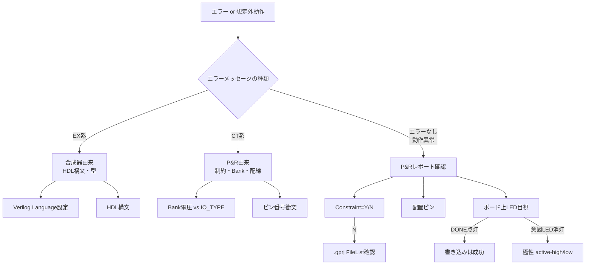

# JJY-FPGA 実装知見集

> 実装中に遭遇した問題と解決方法、Tang Nano 9K / GOWIN EDA / Verilog合成に関する実用知識を蓄積する文書。
> 設計ドキュメント [jjy-fpga-design-doc.md](jjy-fpga-design-doc.md) が「これから何を作るか」を扱うのに対し、本文書は「実際に作ってみて分かったこと」を扱う。

---

## 1. Tang Nano 9K ハードウェア知見

### 1.1 IO Bank 構成

GW1NR-9（Tang Nano 9K搭載品）は3つのIO Bankを持ち、各BankのVCCIO（IO電源電圧）はボード上で固定されている。

| Bank | VCCIO | 備考 |
|------|-------|------|
| 1 | 3.3V | 汎用GPIO |
| 2 | 3.3V | 汎用GPIO、HDMI兼用 |
| 3 | **1.8V固定** | オンボードLED・ボタン・内蔵Flash共用 |

**重要：制約ファイル（`.cst`）の `IO_TYPE` はBank電圧と整合させる必要がある。** Bank 3に配置する信号は `LVCMOS18` を指定すること。`LVCMOS33` を指定するとP&Rで `CT1136 Bank 3 vccio(1.8) is locked by other constraint` エラーになる。

### 1.2 オンボードLEDの仕様

- 個数：6個（LED1〜LED6）
- 接続ピン：10, 11, 13, 14, 15, 16（**すべてBank 3**）
- 極性：**アクティブロー**（FPGAから0を出力すると点灯）
- 駆動：1.8V前提で電流制限抵抗が選定されており、輝度に懸念はない

### 1.3 ボード上のLED種別と混同注意

| LED | 用途 | 制御元 |
|-----|------|-------|
| LED1〜LED6 | ユーザー用 | FPGAのGPIO（ピン10/11/13/14/15/16） |
| DONE | FPGAコンフィグ完了表示 | FPGAコンフィグレーション回路（自動） |
| PWR | 電源 | 給電時常時点灯 |

LED1〜6 と DONE LEDは基板上で**隣接して配置されている**ため視認時に混同しやすい。書き込み直後にDONE LEDが点灯するが、これはユーザーロジックとは独立した系統である。「LED1付近の別のLEDが光っている」と感じた場合、まずDONE LEDを疑う。

### 1.4 デバイス型番

- **PN（Part Number）**: GW1NR-LV9QN88PC6/I5
- **GOWIN EDA内部表記**: gw1nr9c-004
- 末尾の `C6` は商用温度グレード、`I5` は産業温度グレード

### 1.5 オンボードクロック

| 項目 | 値 |
|------|-----|
| 発振周波数 | 27MHz |
| 接続ピン | **52** |
| Bank | 2（3.3V） |
| IO_TYPE | LVCMOS33 |
| GW1NR-9内部のクロックリソース | グローバルクロック（PCLK）として配線可能 |

`.cst` での記述例：

```
IO_LOC "clk" 52;
IO_PORT "clk" PULL_MODE=UP IO_TYPE=LVCMOS33;
```

27MHzは40kHz生成（÷675）、UART 9600bpsや115200bps生成、I2Cマスタクロック生成など、本プロジェクト全体で唯一のクロックソースとなる。GW1NR-9内蔵PLL（rPLL）で他周波数へ昇降することも可能だが、本プロジェクトの初期段階ではPLLを使わず単純なカウンタ分周で対応する。

### 1.6 オンボードボタンの仕様

Tang Nano 9Kにはオンボードボタンが2個搭載されている。設計ドキュメント §9.2 では「ピン3/4」とのみ記載されているが、実機シルク表記とピンの対応は以下の通り。

| 物理ボタン（シルク表記） | 接続ピン | Bank | 極性 |
|----------------------|---------|------|------|
| **S1** | **4** | 3（1.8V） | アクティブロー（押下時 0、解放時 1） |
| **S2** | **3** | 3（1.8V） | 同上 |

注意点：

- **S1とS2のピン番号は直感に反するため要注意**: ボード上の並びは「S1 S2」だが、ピン番号は「4 3」と逆順
- **押下時にGND（0）** : LEDと同じくアクティブロー。HDL側で「押下=信号LOW」として読む
- **アンプッシュ（解放）時の状態** : 内部プルアップ（`PULL_MODE=UP`）を有効にしておく。外付けプル抵抗は不要
- **チャタリング対策必須** : 機械式タクトスイッチのため、押下/解放の瞬間に数ms〜数十msのバウンス（高速ON/OFF振動）が発生する。HDLで直接読むと1回押下が複数回として誤検出される。**デバウンス回路（安定状態を10〜20ms保持してから確定）が必須**
- **メタステーブル対策必須** : 外部の非同期信号をFPGA内部の同期回路に取り込む際、FFが0と1の中間値で固まる「メタステーブル」状態が発生し得る。**2段FFシンクロナイザ**（FFを2個直列に入れる）で確率を実用上ゼロまで下げる
- **典型的な`.cst` 記述**:

```
IO_LOC "btn[0]" 4;
IO_LOC "btn[1]" 3;
IO_PORT "btn[0]" PULL_MODE=UP IO_TYPE=LVCMOS18;
IO_PORT "btn[1]" PULL_MODE=UP IO_TYPE=LVCMOS18;
```

汎用デバウンサ実装例は [hdl/src/debouncer.sv](../hdl/src/debouncer.sv) を参照。

---

## 2. GOWIN EDA 操作知見

### 2.1 Verilog合成モードのデフォルト

GOWIN Synthesis のデフォルト言語設定は **Verilog 2001**。SystemVerilog固有の `logic` 型・`always_ff`・`typedef` などを使うと、以下のような合成エラーになる。

```
ERROR (EX3444) : 'logic' is an unknown type
ERROR (EX3872) : 'logic' is not declared
```

**対処法：**

- `Project → Configuration → Synthesize → General → Verilog Language` を `System Verilog 2017` に変更する
- または `wire` / `reg` のみで記述する（純粋な組合せ回路や単純なFFなら十分）

設計ドキュメント §4.2 ではSystemVerilog採用方針となっているため、本プロジェクトでは前者を選択するのが本筋。ただし `assign` だけの単純な回路では `wire` で実装しても機能上は等価。

### 2.2 ファイル追加時の「Copy file to project」問題

`Add Files` ダイアログで「**Copy file to project**」がデフォルトでONになっている場合がある。このまま追加すると、

1. リポジトリ内の正本（例：`hdl/src/led_on.sv`）とは別に `gowin_project/<name>/src/` 配下にコピーが作られる
2. `.gprj` のFileListはコピー側を参照する
3. 合成パイプラインはコピー側のみを読む
4. **正本への編集が合成に反映されない**

二重管理状態になり、知らずにいると「ソースを変えたのにエラーが消えない」という現象に陥る。

**対処法：**

- ダイアログ右下の「Copy file to project」のチェックを必ず外して追加する
- 既にコピーされている場合は、Removeしてから再追加するか、`.gprj` を直接編集して相対パスに書き換える

本プロジェクトでは `gowin_project/jjy_sim/jjy_sim.gprj` が `../../hdl/src/led_on.sv` のような相対参照を持つ構成にしている。

### 2.3 .gprj 直接編集の注意

GOWIN EDAが起動中に `.gprj` を外部エディタから編集すると、GOWIN側の自動保存で上書きされる場合がある。**直接編集する前にGOWIN EDAを必ず終了させること。**

### 2.4 ファイル追加でフィルタを切り替える

`Add Files` ダイアログのデフォルトファイル種別フィルタは `Verilog Files (*.v, *.sv)` になっていることがあり、`.cst` が一覧に出てこない。フィルタを `Constraints File (*.cst, *.sdc)` に切り替えること。`.sv` だけ追加して `.cst` の追加を忘れると、P&R時に制約が無視される。

---

## 3. ピン制約ファイル（.cst）

### 3.1 基本書式

```
IO_LOC "<port_name>" <pin_number>;
IO_PORT "<port_name>" PULL_MODE=<UP|DOWN|NONE> DRIVE=<mA> IO_TYPE=<standard>;
```

### 3.2 IO_TYPE の選択

配置先BankのVCCIOに整合する規格を指定する。

| Bank VCCIO | 主なIO_TYPE |
|-----------|------------|
| 1.8V | LVCMOS18 |
| 2.5V | LVCMOS25 |
| 3.3V | LVCMOS33 |

不一致の場合は `CT1136` エラー。

### 3.3 PULL_MODE と DRIVE

- `PULL_MODE=UP` : 内部プルアップ。出力ポートでもフローティング防止に有効
- `PULL_MODE=NONE` : プル抵抗なし
- `DRIVE=4|8|16|24` : 駆動電流（mA）。Tang Nano 9Kでは入門時8mAが中庸。アンテナ駆動など大電流が必要な場面で増やす

### 3.4 制約ファイル未登録時の挙動

`.cst` がプロジェクトに登録されていない／空の場合、P&Rは**制約なしで自動配置**を行う。レポート上は `Constraint=N` と表示される。意図と異なるピンに配置され、当然LEDも光らない。

---

## 4. タイミング制約ファイル（.sdc）

`.cst` がピン位置や電気的特性を指定する**物理制約**を担うのに対し、`.sdc`（Synopsys Design Constraints）はクロック周波数・信号遅延・パスの扱いといった**タイミング制約**を担う。GOWIN EDAは業界標準のSDCサブセットをサポートしている。

### 4.1 なぜ必要か

`.sdc` がないと、合成器・配置配線ツールは以下の情報を持てない。

- クロックの周期（27MHz？100MHz？）
- 各FF間の論理パスが1クロック内に終わるかの保証
- 外部から来る信号の到達タイミング
- 出力信号が外部回路に到達するまでの猶予

結果、**動作周波数が低い設計では実機は動くが**、P&Rで以下のような警告が出る。

```
WARN (TA1132) : 'clk' was determined to be a clock but was not created.
```

警告は「クロックとしての使い方は推測したが、明示宣言が無い」を意味し、**機能上は無害**だが、タイミング解析の精度低下や、複数クロックドメイン化したときの問題顕在化につながる。

### 4.2 最小限の `.sdc`

クロック1つだけのプロジェクトでは、以下1行で TA1132警告を解消できる。

```
create_clock -name clk -period 37.037 -waveform {0 18.518} [get_ports {clk}]
```

| 引数 | 意味 |
|------|------|
| `-name clk` | クロック名（任意。後の制約から参照する識別子） |
| `-period 37.037` | 周期（**ns単位**）。1 / 27_000_000 ≈ 37.037 |
| `-waveform {0 18.518}` | 立ち上がり・立ち下がりの時刻（duty 50%） |
| `[get_ports {clk}]` | 対象信号 |

本プロジェクトでは [hdl/constraints/clock.sdc](../hdl/constraints/clock.sdc) として共通配置している。

### 4.3 主要なSDCコマンド

| コマンド | 用途 | 使う場面 |
|---------|------|---------|
| `create_clock` | クロックの周期・波形を宣言 | ほぼ必須 |
| `set_input_delay` | 外部信号がFPGAに届くまでの遅延 | UART/I2C/SPI受信 |
| `set_output_delay` | 出力信号が外部に伝わるまでの猶予 | UART/I2C/SPI送信 |
| `set_false_path` | タイミング解析を行わないパス指定 | 非同期信号、リセット |
| `set_multicycle_path` | 複数クロックかけて伝播するパス | 低速サブシステム |

### 4.4 ファイル運用方針

- `.cst`（物理制約）: モジュールごとに切り替え。`.gprj` 登録を入れ替えて使う
- **`.sdc`（タイミング制約）: 全モジュール共通**。`clock.sdc` のように汎用名で1ファイル整備し、`.gprj` に常時登録しておく

これによりモジュール切替時の `.gprj` 編集量が最小化される。

### 4.5 GOWIN EDAでの登録

`Add Files` ダイアログのフィルタを **`Constraints File (*.cst, *.sdc)`** に切り替えれば、`.sdc` も同じ画面で追加できる。`.gprj` の `<File>` 要素では `type="file.sdc"` として登録される。

```xml
<File path="../../hdl/constraints/clock.sdc" type="file.sdc" enable="1"/>
```

---

## 5. Place & Route レポートの読み方

P&R実行後、`gowin_project/<name>/impl/pnr/<name>.rpt.txt` にレポートが生成される。トラブルシュート時に必ず参照する。

### 5.1 Pinout by Port Name セクション

```
Port Name  | Loc./Bank | Constraint | Dir.  | Site    | IO Type    | Drive | Pull Mode
led        | 10/3      | Y          | out   | IOL5[A] | LVCMOS18   | 8     | UP
```

確認すべきポイント：

| 列 | 確認内容 |
|---|---------|
| `Constraint` | `Y` であること。`N` なら制約ファイル不適用 |
| `Loc.` | 意図したピン番号と一致すること |
| Bank（`Loc.` の後ろの数字） | 意図したBankであること |
| `IO Type` | 制約通りであること |
| `Pull Mode`, `Drive` | 制約通りであること |

`Constraint=N` の場合、まず `.gprj` のFileListを開いて `.cst` が登録されているかを確認する。

---

## 6. Programmer の書き込みモード

| モード | 揮発性 | 用途 |
|-------|--------|-----|
| SRAM Program | 揮発（電源切断で消える） | 動作確認・デバッグ |
| Embedded Flash Mode | 不揮発（電源再投入後も動作） | 本運用 |

開発中はSRAM Programで十分。本プロジェクトでは「家電的な常時運用」を目標とするため、最終段階でEmbedded Flashへ恒久書き込みする。

書き込み前に `Edit → Cable Settings` で `Cable: Gowin USB Cable(FT2CH)` が認識されていることを確認すること。macOSでは初回接続時に `/dev/cu.usbserial-XXXXXXXX` 系のデバイスが2つ（FT2CHはデュアルチャネル）出現する。

---

## 7. トラブルシュート手順

合成・配置配線・書き込み時の問題に対する基本的な切り分け手順。



### 7.1 エラーメッセージのプレフィックス

| プレフィックス | 由来 | 主な内容 |
|---------------|-----|---------|
| `EX` | GowinSynthesis（合成器） | HDL構文、未定義型、未宣言シグナル |
| `CT` | Place & Route | 制約衝突、Bank電圧、リソース不足 |

### 7.2 想定LEDが光らないときのチェックリスト

1. **DONE LEDは点灯しているか？** → していれば書き込みは成功している
2. P&Rレポートで `Constraint=Y` か？ → `N` なら `.gprj` に `.cst` を追加
3. 配置ピンは意図通りか？ → 違うならピン番号誤り
4. `IO_TYPE` はBank電圧と整合しているか？
5. 駆動値（0/1）は極性と合っているか？ → Tang Nano 9KのLEDはアクティブロー（0で点灯）

---

## 8. ファイル構成方針

本プロジェクトは以下の方針でファイルを管理する。

```
jjy-fpga/
├── hdl/
│   ├── src/                  # HDLソース（正本）
│   ├── constraints/          # ピン制約ファイル（正本）
│   └── tb/                   # テストベンチ
├── gowin_project/
│   └── jjy_sim/
│       ├── jjy_sim.gprj      # ../../hdl/ への相対参照
│       ├── src/              # 空（GOWIN EDAコピー先、不使用）
│       └── impl/             # 生成物（gitignore対象）
└── docs/                     # 設計ドキュメント・知見集
```

**原則：**

- HDL・制約の正本は `hdl/` 配下に置く
- `gowin_project/` 配下はGOWIN EDAの作業ディレクトリ（`.gprj` のみバージョン管理、`impl/` は無視）
- ファイル追加時は必ず「Copy file to project」を**外す**
- 中間生成物（`*.fs`, `*.bin`, `*.rpt.txt`, `impl/`）は `.gitignore` 対象

---

## 9. JJYタイムコード実装の教訓

Phase 3 で電波時計同期に苦戦した経験から得た教訓。**設計ドキュメントの記述や日本語Web情報には誤りが多く、NICT公式仕様を直接確認すべき**。

### 9.1 NICT公式仕様の正しい解釈

JJYタイムコードの正解（[NICT JJY 標準電波で送信する時刻符号](https://www.nict.go.jp/sts/jjy_signal.html) より）：

> 秒の信号は、パルス信号の立ち上がりとし、立ち上がり時の55%値（10%値と100%値の中央）が日本標準時の1秒信号に同期します。立ち上がり後、100%値を継続するパルス幅の長さによって、その秒での情報を符号化しています。

| パルス | パルス幅（振幅100%継続時間） | 残り（振幅10%） |
|-------|------------------------|---------------|
| マーカー（M, P0〜P5） | 200ms | 800ms |
| 2進の "1" | 500ms | 500ms |
| 2進の "0" | 800ms | 200ms |

**各秒の頭で振幅10%→100%に立ち上がる**（パルス幅後にOFFに戻る）。

### 9.2 「振幅低下時間」という用語に騙されない

警告。一部の日本語資料・解説サイトでは「振幅低下時間」という用語が使われ、各パルス値（200/500/800ms）が**振幅低下（OFF）の時間**として解説されていることがある。これは**完全な誤り**。NICTの正式仕様では、これらの値は**振幅100%（ON）の継続時間（パルス幅）**を指す。

NICT公式の表は混乱を避けるため明示的に「パルス幅」と記載されており、これが信頼できる一次情報源。

### 9.3 「0」のON時間が最長という直感に反する仕様

報告。データビット "0" と "1" のON時間は以下のように**直感とは逆**。

| ビット | ON時間 |
|-------|-------|
| **マーカー** | **最短（200ms）** |
| "1" | 中（500ms） |
| **"0"** | **最長（800ms）** |

「0は短く、1は長く」と直感的に思いがちだが、**実際は逆**。実装時に値を取り違えるとデータビットが反転して送信され、電波時計のデコードが失敗する。

### 9.4 同期失敗時の典型パターン

OOK極性または値が間違っている場合、電波時計（例：Nitori YT6508）の挙動：

```
1. 手動受信開始
   ↓
2. 約1分後：受信中アイコン表示（信号を検出）
   ↓
3. 約7分後：電波捜索中状態（デコード失敗、再試行）
   ↓
4. 約1分後：再度受信中状態
   ↓
5. 約7分後：アンテナアイコン消失（最終的に失敗）
   ↓ 合計約16分のタイムアウト
```

「受信中アイコンが出る」は信号が物理的に届いている証拠。しかし**タイムコードのデコードに失敗する**と、電波時計は妥当性検証（Plausibility Check）に失敗してタイムアウトする。

### 9.5 妥当性検証（Plausibility Check）への対応

警告。電波時計は誤った時刻同期を防ぐため、**最低2フレーム連続で受信し、フレーム間で分が1だけ進んでいることを確認**してから時刻を確定する。

つまり**固定時刻（同じフレーム）を60秒ごとに繰り返し送信しても、電波時計は同期しない**。動的に分カウンタを実装し、60秒ごとに分の値が +1 されるようにする必要がある。

通算日・年・曜日は数時間以内のテストなら固定値でよい（時の繰り上がりも数時間で発生しない）。最小限「分の進行」だけ実装すれば同期完了する。

### 9.6 アンテナ駆動の電気的考察

報告。Tang Nano 9KのオンボードLED（Bank 3、1.8V、ピン10〜16）は**外部ヘッダに引き出されていない**。アンテナ駆動には外部ヘッダ（J6/J7）に出ているピンを使う必要がある。

| 観点 | LED1（ピン10、Bank 3） | 外部ヘッダ（例：ピン25、Bank 1/2） |
|------|----------------------|---------------------------------|
| 電圧 | 1.8V | 3.3V |
| 推奨DRIVE | 8mA | **24mA** |
| 用途 | 目視確認 | アンテナ駆動 |

実用構成は**「両ピンに同じOOK信号を並列出力」**するデュアル出力。LED1で動作目視しつつ、ヘッダ側でアンテナ駆動できる。

### 9.7 同期成功時の確認方法

提案。

1. 電波時計を**手動受信モード**に切り替え、ループアンテナに密着
2. 5〜10分以内に**受信中アイコン消失 + 時刻表示更新**
3. 表示時刻が**FPGA起動からの経過時間 + 起動時刻**に近いことを確認（例：起動時 12:00、起動から5分で「12:05」表示）

電波時計の表示が固定時刻のまま動かない場合は同期失敗。受信中アイコンがタイムアウトで消える場合も失敗。

### 9.8 トラブルシュートチェックリスト

Phase 3 で同期失敗した場合の確認順序：

1. **OOK極性**：各秒の頭で carrier=carrier_40k（ON）になっているか。ピンに直接アクセスできない場合、LED1の見え方で確認（マーカー時は短く点灯、"0" 時は長く点灯）
2. **パルス幅の値**：M=200ms、"1"=500ms、"0"=800ms（**ON時間**として）
3. **動的フレーム生成**：分カウンタが60秒ごとに +1 されているか
4. **BCD変換**：時・分・通算日・年・曜日のBCDビット順
5. **パリティ計算**：PA1（時の偶数パリティ）、PA2（分の偶数パリティ）
6. **マーカー位置**：秒0, 9, 19, 29, 39, 49, 59 でマーカー（合計7個）
7. **40kHzキャリア周波数**：実機で40,059Hz程度（誤差±数Hz以内）
8. **アンテナ密着距離**：数cm以内、ループアンテナの中心と電波時計のバーアンテナ軸が直交
